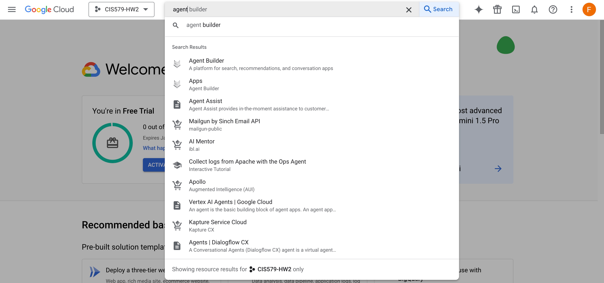
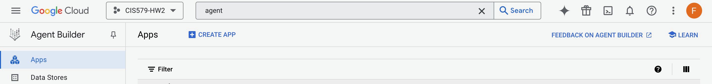
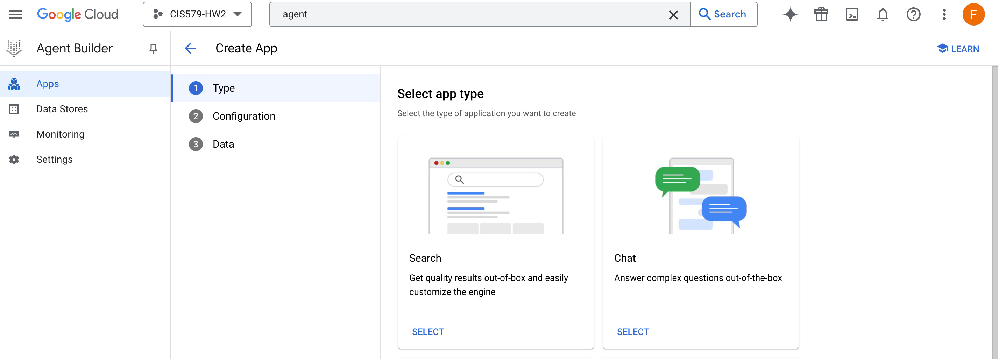
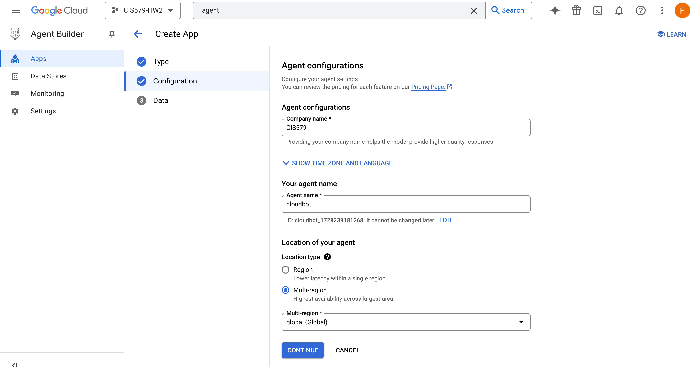
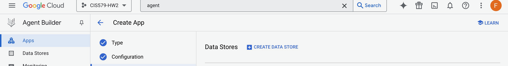
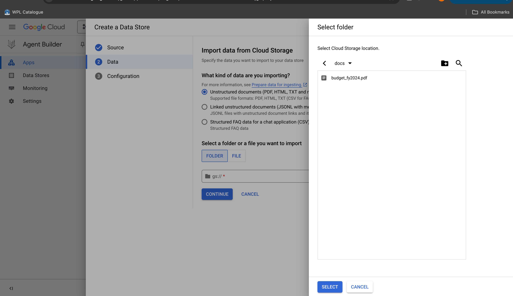
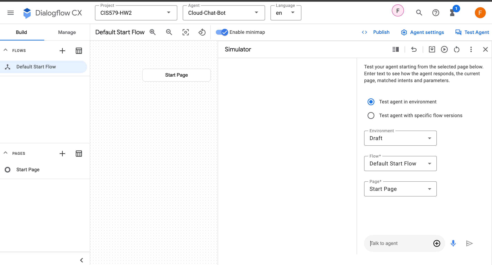
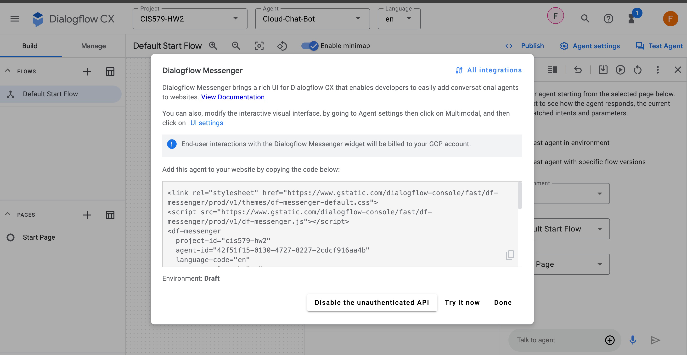
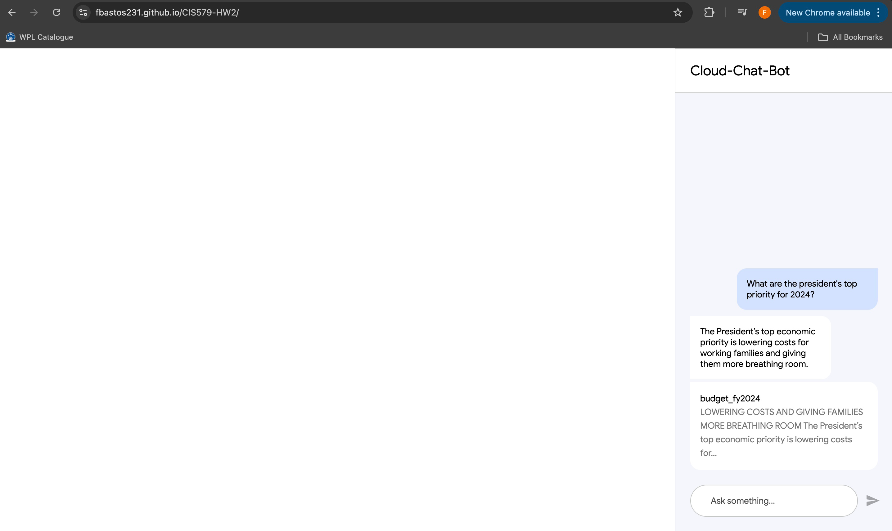

## CIS-579-002-Artificial Intelligence - Homework 2 Submission

1. Building a Conversational Q&A Chatbot With A Gemini Pro Free:
Reference Video: https://www.youtube.com/watch?v=6hQF80_xMkQLinks to an external site.

The following were the steps I followed to build the cloud chat bot

   

   

   

   
   
   
   
   
   
   
   
   
   
   

This is where the chat bot is currently deployed: https://fbastos231.github.io/CIS579-HW2/

- What is the primary purpose or goal of your chatbot? Is it informational, conversational, or transactional?

    I used a similar pdf for the my chatbot as the reference video so this chat bot would be informational. Specifically focused on the US 2024 budget.  

- How did you feel working with Google AI Studio?

    Using Google AI Studio while following the video felt quite intuitive. However, I saw there were many options and settings that are available but were not used in this application.

- How will you gather feedback from users to improve the chatbot over time?

    After each interaction, I would prompt users to provide quick feedback on their experience, which would offer valuable insights into areas needing enhancement. Additionally, I would analyze recurring feedback trends and implement updates to address common issues, ensuring the chatbot evolves to meet user needs over time.

- How will you test the chatbot to ensure it performs as expected?

    I would release a beta version of the chatbot, systematically testing its responses across various scenarios to evaluate its accuracy, relevance, and consistency. Continuous monitoring and user feedback would help identify areas for improvement, allowing for iterative adjustments to optimize performance before full deployment.

- What are the ethical considerations to keep in mind when designing and deploying the chatbot?
 
    When designing and deploying a chatbot, it’s crucial to prioritize user privacy, fairness, and transparency to ensure ethical interactions and trustworthiness. Developers must also actively work to prevent bias, ensure accountability, and provide users with control, especially in sensitive or complex situations.

2. Create a LOCAL Python AI Chatbot in Minutes using Ollama
Reference Video: https://www.youtube.com/watch?v=d0o89z134CQLinks to an external site.

please see zip file attached with code for local chatbox. It can also be found at: https://github.com/fbastos231/CIS579-HW2

- What is the primary purpose or goal of your chatbot? Is it informational, conversational, or transactional?

    I followed every step in the reference video so this chat bot would be conversational. It contains all of the information it was trained on by meta.  

- How did you feel working with Local LLM and using VS Code.

    I felt more confortable working in the local enviroment as there is less risk to the data shared with the model. Also, no need to provide a creditcard to start using the model.

- How will you gather feedback from users to improve the chatbot over time?

    No different from the answer above: After each interaction, I would prompt users to provide quick feedback on their experience. However, more thought would be needed to devise a way to collect and analyse this data since this model is running locally.

- How will you test the chatbot to ensure it performs as expected?

    Here the chat history could be saved in order to be analyze.

- What are the ethical considerations to keep in mind when designing and deploying the chatbot?

    Same as above, it is crucial to prioritize user privacy and data security by transparently informing users about data collection practices and implementing robust protection measures.

